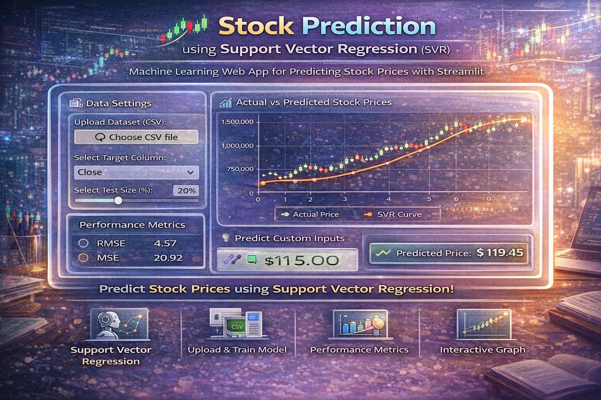

<p align="center">
  
</p>
---

# 📈 Stock Prediction using Support Vector Regression (SVR)

## 🚀 Project Overview

This project focuses on predicting stock prices using **Support Vector Regression (SVR)**, a powerful machine learning algorithm. The model is trained on historical stock data to learn patterns and make accurate predictions.

The project also includes an **interactive Streamlit web application** where users can upload their dataset, train the model, and visualize predictions.

---

## 🎯 Objectives

* Build a machine learning model using SVR
* Predict stock prices based on input features
* Evaluate model performance using standard metrics
* Create an interactive UI using Streamlit
* Make the project portfolio-ready for real-world applications

---

## 🛠️ Technologies Used

* Python 🐍
* Pandas 📊
* NumPy 🔢
* Scikit-learn 🤖
* Matplotlib 📈
* Streamlit 🌐

---

## 📂 Project Structure

```
stock_prediction_svr/
│
├── app.py                # Streamlit Application
├── data.csv              # Dataset
├── requirements.txt      # Dependencies
└── README.md             # Project Documentation
```

---

## ⚙️ How It Works

1. Upload a CSV dataset
2. Select the target column (stock price)
3. Split data into training and testing sets
4. Train the SVR model
5. Evaluate performance using:

   * RMSE (Root Mean Squared Error)
   * MSE (Mean Squared Error)
   * R² Score
6. Visualize actual vs predicted values
7. Predict custom inputs using the trained model

---

## 📊 Machine Learning Model

* Algorithm: **Support Vector Regression (SVR)**
* Type: Supervised Learning
* Used for: Continuous value prediction (Regression)

---

## 📈 Evaluation Metrics

* **RMSE** → Measures prediction error
* **MSE** → Average squared error
* **R² Score** → Model accuracy percentage

---

## ▶️ How to Run the Project

### Step 1: Clone the Repository

```
git clone https://github.com/selvan-01/stock_prediction_svr.git
cd stock_prediction_svr
```

### Step 2: Install Dependencies

```
pip install -r requirements.txt
```

### Step 3: Run Streamlit App

```
streamlit run app.py
```

---

## 🌐 Streamlit Features

* Upload dataset 📁
* Select target column 🎯
* Adjustable test size ⚙️
* Model training button 🤖
* Performance metrics 📊
* Visualization graph 📈
* Custom prediction input 🔮

---

## 🔥 Future Enhancements

* Add data preprocessing & scaling
* Hyperparameter tuning (GridSearchCV)
* Use advanced models (Random Forest, XGBoost)
* Deploy app online (Streamlit Cloud / Render)
* Add real-time stock API integration

---

## 📌 Use Cases

* Stock market analysis
* Financial forecasting
* Data science learning project
* Portfolio project for ML roles

---
## 🔗 Links

- 💼 [LinkedIn](https://www.linkedin.com/in/senthamil45)
- 🌍 [Portfolio](https://senthamill.vercel.app/)
- 💻 [GitHub](https://github.com/selvan-01/stock_prediction_svr.git)

## 👨‍💻 Author

**S. Senthamil Selvan (Sen)**
💡 Aspiring ML Developer | AI Enthusiast

---

## 🔗 Portfolio

👉 https://senthamill.vercel.app/

---

## ⭐ Support

If you like this project, give it a ⭐ on GitHub and share it!

---
